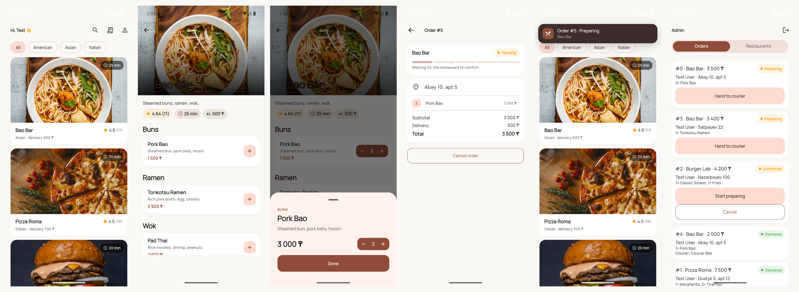
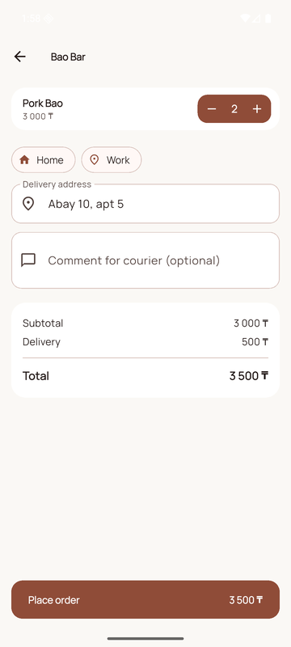
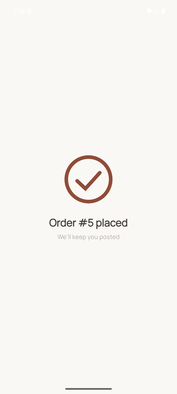
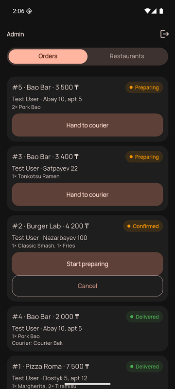
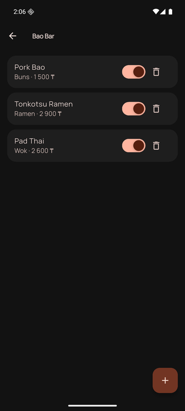

<div align="center">

# 🛵 Food Delivery

**Flutter + FastAPI food delivery app. Three roles, live WebSocket updates, a real motion system.**

[](https://github.com/Kennurken/food-delivery/actions/workflows/ci.yml)


**Live:** [app](https://food-delivery-drab-theta.vercel.app) · [API](https://food-delivery-api-jet.vercel.app/health)

The public API stores data in Neon Postgres. Register a customer account there. Local-only demo logins (`user@food.dev / user123` and the courier/admin twins) are created by `uv run python -m app.db.seed` against sqlite — they are not on production.



</div>

## What's inside

| Customer | Courier | Admin |
|---|---|---|
| Browse by cuisine, search, save restaurants, sort by distance | Pick up confirmed orders, live map | Confirm / advance / cancel any order |
| Cart with morphing stepper, saved addresses | Advance step by step to *delivered* | Add restaurants, toggle open/closed |
| Live order tracking, rate after delivery | Live "ready for pickup" banners | Menu editor, floor plan, table QR |
| Scan a table QR, or pick up without a courier | | Plans, staff, kitchen board, table QR |

Every status change is pushed over WebSocket to whoever cares — the customer, the assigned courier, all staff — and surfaces as an in-app banner.

<details>
<summary><b>More screens</b> (light + dark)</summary>
<p align="center">
    
</p>
</details>

## Layout

```
food-delivery/
├── backend/                 # Python 3.12+, FastAPI, SQLAlchemy 2, Alembic, JWT
│   ├── app/
│   │   ├── api/v1/          # auth, me, restaurants, orders, admin, ws
│   │   ├── core/            # config, security, events, geo (Photon/OSM/OSRM)
│   │   ├── db/              # session, seed
│   │   ├── models/          # User, Address, Restaurant, MenuItem, Order, OrderItem
│   │   ├── schemas/         # Pydantic I/O
│   │   ├── services/        # order_service (pricing, status machine, rating)
│   │   └── main.py
│   ├── alembic/             # migrations
│   └── tests/
└── mobile/                  # Flutter 3.47, Riverpod 3, go_router, dio, flutter_animate
    └── lib/
        ├── core/            # api client + WS stream, router, theme + motion tokens, widgets
        └── features/        # auth, restaurants, cart, orders, courier, admin, profile, notifications
```

## Run

Backend:
```bash
cd backend && uv sync && uv run alembic upgrade head && uv run python -m app.db.seed && uv run uvicorn app.main:app --reload
```
Or with Postgres: `docker compose up --build` (then seed inside: `docker compose exec api uv run python -m app.db.seed`).

Swagger: http://127.0.0.1:8000/docs — dev users `user@food.dev / user123`, `courier@food.dev / courier123`, `admin@food.dev / admin123`.

Mobile:
```bash
cd mobile && flutter run --dart-define=API_URL=http://10.0.2.2:8000
```
Android emulator hits `10.0.2.2:8000` in debug if you skip the define; iOS sim hits `127.0.0.1:8000`. Release builds require `API_URL`.

## API

| Method | Path | Auth |
|---|---|---|
| POST | /api/v1/auth/register | – |
| POST | /api/v1/auth/login/json | – |
| POST | /api/v1/auth/refresh | – |
| GET | /api/v1/auth/me | user |
| GET | /api/v1/restaurants?q=&cuisine= | – |
| GET | /api/v1/restaurants/{id} | – |
| POST | /api/v1/orders | user |
| GET | /api/v1/orders | user; kitchen: `?restaurant_id=` |
| GET | /api/v1/orders/{id} | user / kitchen |
| POST | /api/v1/orders/{id}/cancel | customer |
| GET | /api/v1/orders/available | courier |
| POST | /api/v1/orders/{id}/accept | courier |
| POST | /api/v1/orders/{id}/advance | courier (assigned) |
| PATCH | /api/v1/orders/{id}/status | admin / kitchen |
| PATCH | /api/v1/me | user |
| POST | /api/v1/me/password | user |
| GET/PUT/DELETE | /api/v1/me/favorites[/{restaurant_id}] | user |
| GET/POST/PATCH/DELETE | /api/v1/me/addresses[/{id}] | user |
| POST | /api/v1/orders/{id}/rate | customer (delivered) |
| GET | /api/v1/restaurants/cuisines | – |
| GET/POST/PATCH | /api/v1/admin/restaurants[/{id}] | admin |
| POST | /api/v1/admin/restaurants/{id}/menu | admin |
| PATCH/DELETE | /api/v1/admin/menu/{id} | admin |
| GET/POST | /api/v1/admin/restaurants/{id}/floors | admin / member |
| GET/PATCH/DELETE | /api/v1/admin/floors/{id} | admin / member |
| PUT | /api/v1/admin/floors/{id}/layout | admin / member |
| GET/POST | /api/v1/admin/floors/{id}/versions[/{vid}/restore] | admin / member |
| GET | /api/v1/admin/floors/{id}/objects/{oid}/qr | admin / member |
| GET | /api/v1/qr/{token} | – |
| GET | /api/v1/billing/plans | – |
| GET | /api/v1/platform/overview | admin |
| GET | /api/v1/admin/restaurants/{id}/workspace | admin / member |
| GET/POST/DELETE | /api/v1/admin/restaurants/{id}/staff[/{user_id}] | admin / member |
| GET | /api/v1/me/memberships | user |
| GET | /api/v1/platform/audit | admin |
| GET | /api/v1/geo/search?q=&lat=&lng= | user |
| GET | /api/v1/geo/reverse?lat=&lng= | user |
| GET | /api/v1/geo/route?from_lat=&from_lng=&to_lat=&to_lng= | user |
| POST | /api/v1/courier/location | courier |

Order status machine (every channel): `pending → confirmed → preparing → on_the_way → delivered`; cancel from `pending`/`confirmed`. `on_the_way` means out with the courier for **delivery**, ready at the pass for **pickup** / **qr_table**. Couriers only see delivery. `GET /orders?restaurant_id=` is the kitchen ticket list.

Live updates: `WS /api/v1/ws?token=<jwt>` streams `{"type":"order.updated","cause":"status"|"location","order":{...}}`. Location pings do not toast. Couriers also get unassigned **delivery** pickable orders. Hub is in-process — one instance; swap for Redis pub/sub to scale out.

Map: Flutter draws Carto/OSM tiles. Search, reverse geocode, and driving routes go through the API (Photon + Nominatim + OSRM) so one User-Agent hits OSM. Default camera is Almaty. Address picker uses a center pin (2GIS-style). Courier GPS is real; we do not fake motion.

Login and refresh are rate-limited. Access tokens last 60 minutes; a 30-day refresh token issues a new access token. The app refuses to start in `ENV=prod` with a short/default `SECRET_KEY`, `CORS_ORIGINS=*` (unless `CORS_ORIGIN_REGEX` is set), or a sqlite `DATABASE_URL` (unless `ALLOW_EPHEMERAL_DB=1` for a throwaway demo). `/docs` is off in prod. `python -m app.db.seed` in prod (or `--catalog-only`) inserts restaurants only and mints random staff passwords — it will not create `admin123` / `user123`.

Schema migrations: `cd backend && uv run alembic revision --autogenerate -m "..." && uv run alembic upgrade head`.

Fly: `cd backend && ./deploy.sh` (creates the app + Postgres, sets `SECRET_KEY` once, never reseeds). Health: `GET /health` pings the database.

Cloud (Vercel + Neon): the API is a FastAPI function; the Flutter web client is a static deploy. Postgres is Neon (`DATABASE_URL` pooled, SQLAlchemy `NullPool`). Catalog seed is idempotent and does not insert demo passwords. WebSockets work on Fluid compute with a ~5 min cap; the client reconnects.

```bash
# API
cd backend && vercel --prod --yes
# Web (after API URL exists)
cd mobile && flutter build web --release --dart-define=API_URL=https://food-delivery-api-jet.vercel.app
cp web/vercel.json build/web/ && vercel --prod --yes build/web
```

Live right now: [food-delivery-drab-theta.vercel.app](https://food-delivery-drab-theta.vercel.app) talks to [food-delivery-api-jet.vercel.app](https://food-delivery-api-jet.vercel.app/health).

Mobile UI is English / Russian / Kazakh; pick the language in Profile. Native release builds need `--dart-define=API_URL=https://…`.

## Motion system

`mobile/lib/core/theme/motion.dart` holds the tokens; `core/widgets/` the primitives. Values lifted from
[animate-ui](https://animate-ui.com) and [jitter](https://jitter.video/templates/ui-elements/) presets:

| Primitive | Source | Notes |
|---|---|---|
| `Pressable` | animate-ui Button `tapScale 0.95` / `hoverScale 1.05` | wraps cards, buttons, stars; no scale if reduced-motion |
| `SlidingNumber` | jitter Counter | digits roll on change — cart totals, qty |
| `.stagger(i)` | jitter Animated App List | fade + slide-up, 55 ms interval |
| `Shimmer` / `Bone` | — | skeleton while lists load |
| `SuccessCheck` | jitter Loading → Success | drawn with `CustomPainter` after checkout |
| `StretchSwitch` | animate-ui Switch `pressedWidth` | thumb stretches while pressed |
| `PillTabBar` / `SlidingBottomNav` | animate-ui Tabs (spring 300/32) + jitter Navigation Bar | sliding pill on customer tabs |
| `LiveToast` | jitter Simple Notification | WS events → top banner, per role |
| `AnimatedGradient` | animate-ui Gradient background | login backdrop |
| `QuantityStepper` | jitter View Cart: Split | `+` morphs into `− n +` |
| Item bottom sheet | animate-ui Sheet (spring 150/22) | emphasized curve + dish photo |
| `Hero` restaurant image | — | list → detail |
| `AppShell` | phone-width storefront | max 560px column on web/desktop |
| `DishThumb` | — | menu, cart, and item sheet photos |

Theme: Manrope via `google_fonts`, light + dark from one seed, 20px radii, flat cards.

## Tests

```bash
cd backend && uv run pytest
cd mobile && flutter test
```

## Roadmap

- [x] Courier role + order assignment
- [x] Alembic migrations, Postgres via docker compose
- [x] Live order updates over WebSocket
- [x] GitHub Actions CI (ruff, pytest, alembic check, dart format, analyze, flutter test)
- [x] Customer profile, saved addresses (apt / entrance / floor / intercom)
- [x] Favorite restaurants
- [x] Admin floor-plan editor (floors, zones, tables, save/undo)
- [x] Order rating → restaurant running average
- [x] Cuisine filter
- [x] Admin panel in-app (add restaurants, confirm/advance orders, toggle open, edit menu)
- [x] Refresh tokens, login rate limits, prod secret/CORS/sqlite guards
- [x] en / ru / kk UI
- [x] Vercel + Neon (persistent orders, no public `admin123`)
- [x] Pickup + kitchen board (same status machine)
- [x] Map (OSM tiles, geocode/route proxy, live courier pin)
- [ ] Push notifications when app is in background (FCM)
- [ ] Payments (Kaspi / Stripe)
